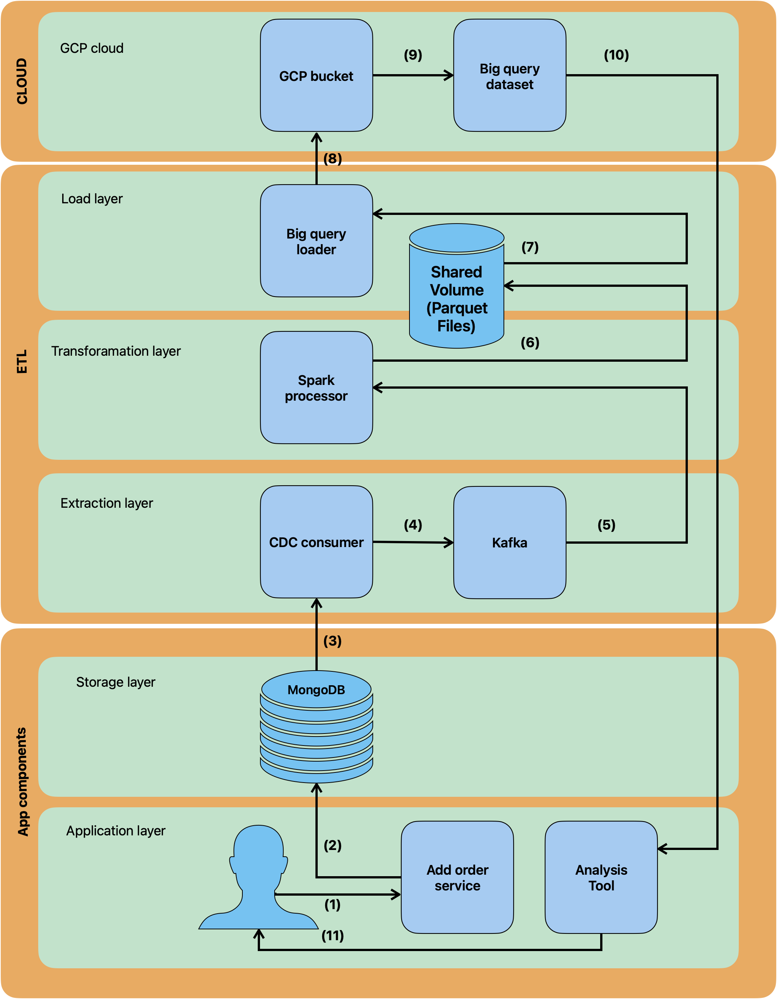

Personally I do not have a gcp account and i did not want to add my card for creating one, 
so the full pipeline is not complete. 

Nothing to hide I clearly used claude AI to support development.
I did not have any hands-on experience with Kafka and Spark.

Running from the project root folder
<bash deploy.sh>
builds all the images and starts storage services, cdc services, and process services.
In a final setup, the script should manage gcp resources using scripts contained in gcp-utils creating a gcp bucket and a bigquery dataset after asking for authentication sourcing from variables defined in .env.  (gcp project must exist). 
NB authentication and bq dataset creation work properly, but gcp bucket creation does not
since it requires a billing account which i do not have (last rows on deploy.sh commented out).
At the end of the setup, the analysis-tool should launch (commented out) allowing the user to query data from bq in an iterative way.

General architecture and data flow 

To test the pipeline run 
<bash test.sh> 
It will insert a second order (data-samples/order-2.json) and generate a log folder containing one log file for each service called during the process (until bq loader). Only containers logs for this project are requested.

General considerations:
Three different docker compose files for separation of layers.
MongoDB in replica-set mode required for mongo change stream but no actual replica does exist. 
CDC consumer is a custom python script that captures changes in mongodb
and publishes operations to kafka (orders-cdc topic).
Kafka acts as a 'buffer' decoupling producer and consumer. 
Spark-based process-service is a custom script that subscribes to kafka topic and processes
events generating parquet files stored in a docker volume.
bigquery-loader-service reads parquet files from the docker volume each 30 seconds and
uploads them to gcp bucket and bq dataset. eventID can be used via GROUP_BY on BQ for deduplication.

Limitation -> mitigation:
Storage: 
- No RAID -> implement a RAID solution for redundancy
- no failure recovery strategies

CDC: 
- no horizontal scaling -> partition collection and assign a CDC replica to each partition
- in memory-resumee token  -> add persistency
- no event ID that can be useful for  deduplication later 

Kafka:
- in-memory event queue -> add persistence via volume
- single-broker can cause data loss on broker failure-> add redundancy

Spark processor:
- no horizontal scaling ->  add replicas
- insert only -> develop other CRUD operations
- in-memory checkpoints -> add persistency

BQ-loader:
- polling for new parquet files each 30 seconds -> implement a producer-consumer paradigm decoupling 
  spark and loader (e.g. using another kafka instance)
- sequential limits upload throughput

improvements: 
- move from local docker volumes to cloud storage (e.g. minio/S3)

Delivery semantics: 

MongoDB -> CDC | At-least-once policy granted by change streams (actually not operational since resumee tokens are in memory)
CDC -> Kafka | At-least-once via producer acknowledgments (kafka aknowledges all messages but there may be duplication, idempotency should be enabled)
Kafka -> Spark | at least once using spark checkpoint (actually not operational since checkpoints are in-memory)
Spark -> Parquet | at-least-once
Parquet -> BigQuery | At-least-once  

In general delivery semantics should be revised
